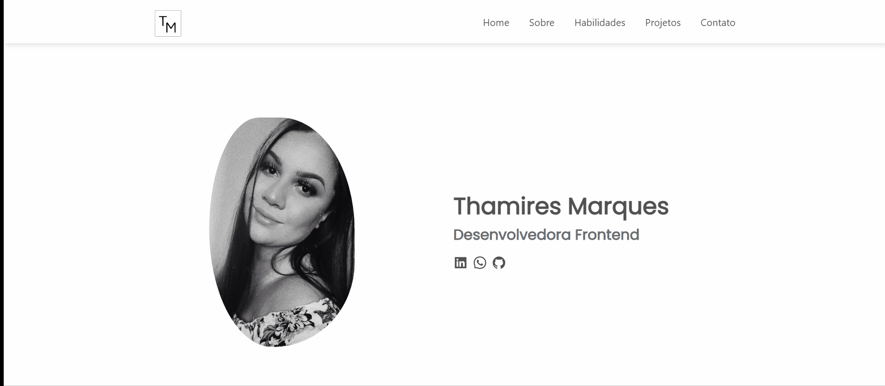

# Portfólio - React
*Onde me apresento e demonstro minhas habilidades.*

🛠️
- javaScript/React - Para a aplicação ser Single Page Application (SPA).
- Styled components - Para estilização dos componentes.
- React router-dom - Para a navegação entre as páginas.
- Hooks

## Quer rodar esse projeto no seu computador?
Para clonar/baixar esse projeto, siga as solicitações do GitHub.
Usar um editor de código de sua preferência para abrir o projeto.
Passando o comando "npm install" no terminal, será instalados os pacotes que foram utilizados.
